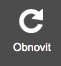

  
  
  
  
  {{ continue }}
  
  
  
  
  
  
  
  
  
  
  <li><a href="wiki/{{ node_url }}">{{ slug }}</a></li>
  
  
  <li><a href="wiki/{{ node_url }}">{{{slug}}</a></li>
  
  
  
  
# wiki
test test test

* TOC
{:toc}

## wiki 2
xxx

## wiki 3
xxx

